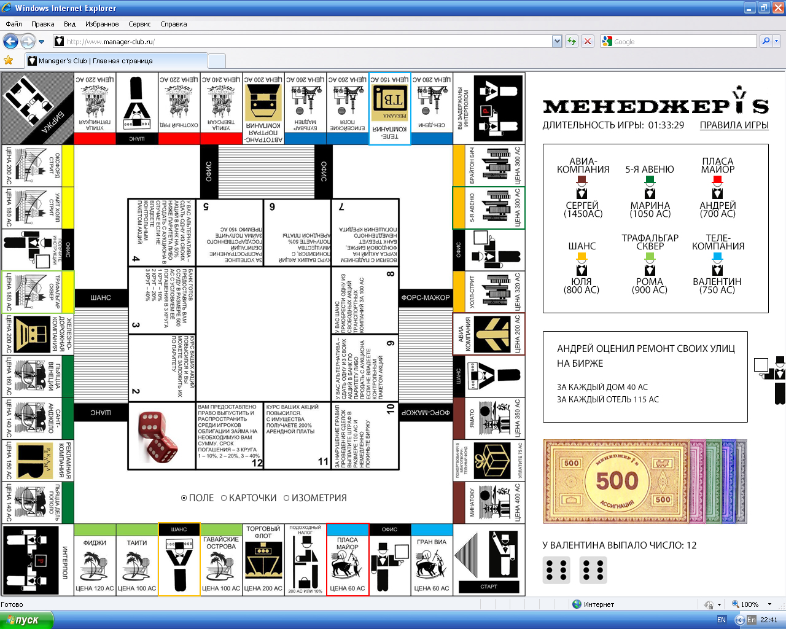

# Manager-s-Club
A clone of the classic board game (Monopoly) released in the USSR at the end of perestroika  

  

# Development
If you'd like to contribute to this repository, here's how you can set it up for development:

1. Fork this repository
2. Clone the fork to your local machine
3.	Create your feature branch (git checkout -b my-new-feature)
4.	Commit your changes (git commit -am 'Add some feature')
5.	Push to the branch (git push origin my-new-feature)
6.	Create a new Pull Request

If you'd like your changes to be considered for the original repository, simply submit a pull request after you've made your changes.  
